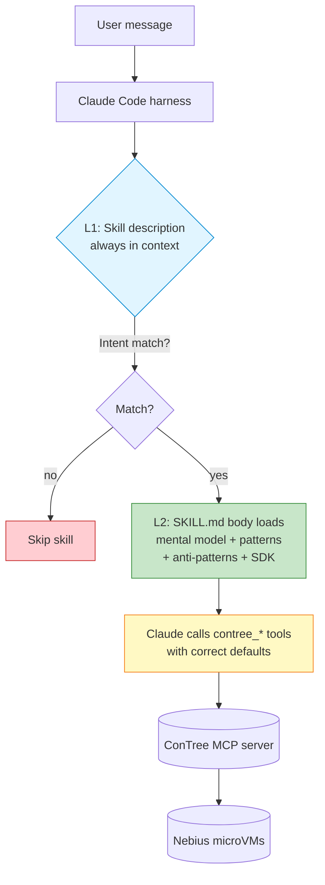

# ConTree Skill for Claude Code

[](LICENSE)
[](#rollout-plan)
[](https://docs.claude.com/en/docs/claude-code/skills)

A Claude Code [Skill](https://docs.claude.com/en/docs/claude-code/skills) that teaches Claude how to use [ConTree](https://contree.dev) — Nebius's sandboxed container execution platform with Git-like branching — idiomatically and efficiently.

> [!TIP]
> **Install:**
> ```bash
> git clone https://github.com/opencolin/contree-skill ~/.claude/skills/contree
> ```
> Then restart Claude Code. The skill auto-loads when ConTree-related tasks come up.

## Repository layout

| File | What's in it |
|---|---|
| **[`SKILL.md`](SKILL.md)** | The skill itself — ~400 lines of guidance loaded into Claude when ConTree tasks come up |
| **[`README.md`](README.md)** *(this file)* | Product Requirements Document — the why, who, and how |
| **[`references.md`](references.md)** | Every doc, repo, and source consulted during research |
| **[`strategy.md`](strategy.md)** | External market analysis and strategic use-case tiers |

---

## Product Requirements Document

| | |
|---|---|
| **Product** | ConTree Skill for Claude Code |
| **Author** | Colin ([@opencolin](https://github.com/opencolin)) |
| **Status** | v0.1 — Alpha, seeking feedback from Nebius ConTree team |
| **Last updated** | 2026-04-16 |

### Contents

1. [TL;DR](#1-tldr)
2. [The Problem](#2-the-problem)
3. [Users & Jobs-to-be-Done](#3-users--jobs-to-be-done)
4. [Product Scope](#4-product-scope)
5. [Solution Design](#5-solution-design)
6. [Success Metrics](#6-success-metrics)
7. [Dependencies & Risks](#7-dependencies--risks)
8. [Rollout Plan](#8-rollout-plan)
9. [Open Questions for Nebius](#9-open-questions-for-nebius)
10. [Appendix](#appendix)

---

## 1. TL;DR

Claude Code users who connect the ConTree MCP server get 17 new tools and 10 prompts — but without guidance, Claude tends to misuse them in ways that waste compute and frustrate users (forgetting `disposable=false`, spawning VMs for `ls`, re-syncing unchanged files, etc.). This skill is a ~400-line instruction set that progressively discloses ConTree's mental model, workflow patterns, and gotchas to Claude *only when the user's intent matches ConTree's use cases*. It covers both the MCP server and the Python SDK.

> [!NOTE]
> **Goal:** Make ConTree the default Claude-native answer to "I need to run this safely / in parallel / with rollback" — without the user having to hand-hold Claude through every invocation.

---

## 2. The Problem

### 2.1 What Nebius ships today

Nebius ships ConTree as three things:

1. **Managed service** — microVM-isolated container runtime with git-like branching
2. **MCP server** (`contree-mcp`) — 17 tools + 10 prompts + 7 guides, bundled with a system prompt embedded in `app.py` that teaches the CHECK-PREPARE-EXECUTE pattern
3. **Python SDK** (`contree-sdk`) — sync and async clients with image/session abstractions

The MCP server's embedded system prompt is excellent, but it only applies *inside that MCP session's model context*. And in practice, Claude Code users often:

- Don't read long system prompts carefully on every turn
- Confuse MCP tool patterns with generic shell/docker habits
- Miss the subtle distinctions (disposable vs persisted, sessions vs images, `mode="any"` cancelling siblings)

### 2.2 The concrete failure modes we saw

Running Claude against the raw MCP tools with no skill, we observed:

| Failure mode | Frequency | Cost |
|---|---|---|
| `pip install` without `disposable=false` → packages vanish | 🔴 Very common | 1 wasted VM + confused re-runs |
| `contree_run "ls /app"` instead of `contree_list_files` | 🔴 Very common | 1 wasted VM per inspection |
| Re-running `contree_rsync` before every `contree_run` | 🟠 Common | Wasted upload bandwidth |
| `contree_import_image` without `contree_list_images` check | 🟠 Common | Duplicate imports, wasted import VM |
| Chaining `apt update && apt install && ... && run` in one command | 🟠 Common | No rollback on failure, whole thing re-runs |
| Mixing up `files` param direction (UUID vs path) | 🟡 Occasional | Hard-to-debug "file not found" |
| `wait_operations mode="any"` silently cancelling siblings | 🟡 Rare but expensive | Lost work user didn't know was lost |

> [!IMPORTANT]
> These aren't Claude being dumb — they're the *default* behaviors of a model that's been trained on Docker/shell idioms and doesn't know ConTree's specific model.

### 2.3 Why a Skill is the right abstraction

Claude Code Skills are loaded **progressively** based on the user's intent:

| Level | Loaded when | Size |
|---|---|---|
| **L1 — Description** | Always in context | ~100 words |
| **L2 — SKILL.md body** | When skill triggers | ~500 lines |
| **L3 — Bundled resources** | On demand | Unlimited |

A well-tuned description triggers *only* when the user is actually going to use ConTree — so the full workflow guidance doesn't pollute unrelated conversations. This is the right fit for tool-specific expertise.

---

## 3. Users & Jobs-to-be-Done

### 3.1 Primary persona — SWE-bench / agent researcher

> *"I'm iterating on a coding agent. I need 7,000 preloaded environments, the ability to branch from the same checkpoint, and per-run metrics. My agent does MCTS over patches and I need sibling execution to be cheap."*

**JTBD:** Run thousands of parallel, branchable, VM-isolated executions from a Claude-driven agent loop.

### 3.2 Secondary persona — Claude Code power user

> *"I asked Claude to 'try a few approaches to fix this bug in parallel' and it made a mess of my working directory. I want it to do that in a sandbox."*

**JTBD:** Get Claude to explore multiple solution paths without touching the host filesystem.

### 3.3 Tertiary persona — Agent builder

> *"I'm building an agent that generates untrusted code. I need hardware-level isolation and rollback. I want to write Python, not YAML."*

**JTBD:** Use the ConTree SDK idiomatically from Python, with clear patterns for sessions vs branching.

---

## 4. Product Scope

### 4.1 In scope ✅

- **MCP guidance** — all 17 tools, the CHECK-PREPARE-EXECUTE pattern, tool-cost reference table, parallel execution, branching
- **SDK guidance** — sync/async clients, `images.use()` vs `.oci()` vs `.import_from()`, sessions vs images distinction, file handling (list/dict/`UploadFileSpec`), subprocess-like `popen`
- **Anti-pattern coverage** — all 7 failure modes from §2.2, plus `mode="any"` cancellation
- **Setup instructions** — for users who don't have ConTree configured yet
- **Mental model upfront** — the Git analogy is front-loaded so Claude's instincts map correctly

### 4.2 Out of scope (for v0.1) ❌

- **REST API guidance** — MCP and SDK cover 95% of Claude Code usage
- **SWE-bench integration** (`mini-swe-agent` `ContreeEnvironment`) — separate follow-up skill
- **Workflow-specific bundled scripts** — save for v0.2 once we see repeated patterns in evals
- **Registry auth UX polish** — covered briefly, but a deep dive is separate
- **Image lineage / rollback tree visualization**

### 4.3 Explicit non-goals

- **Not a replacement for the MCP server's embedded system prompt.** This skill layers on top of that, providing persistent guidance across model turns.
- **Not a ConTree marketing page.** The skill is for Claude, not for humans reading docs. The README (this file) is the marketing page.

---

## 5. Solution Design

### 5.1 Architecture



### 5.2 Key design decisions

<details>
<summary><b>Decision 1:</b> Single SKILL.md, not domain-split references</summary>

ConTree's surface area is small enough (17 tools, ~10 concepts) that splitting into `references/mcp.md` and `references/sdk.md` would cost more context-switches than it saves. Revisit at v0.2 if the file exceeds 500 lines.
</details>

<details>
<summary><b>Decision 2:</b> Description-first triggering</summary>

The skill description uses a "pushy" style (per skill-creator best practices) and lists specific MCP tool names. This catches both (a) users who explicitly mention ConTree and (b) users whose intent matches (`"run this in a sandbox"`, `"try N approaches in parallel"`) even without the brand name.
</details>

<details>
<summary><b>Decision 3:</b> Git analogy front-loaded</summary>

Every ConTree concept maps cleanly to Git (image = commit, branch = branch, tag = tag, disposable = detached HEAD). Claude already has strong priors about Git, so we lean on them instead of inventing new vocabulary.
</details>

<details>
<summary><b>Decision 4:</b> Tool-cost table as a memory aid</summary>

Claude's biggest non-obvious failure was spawning VMs for free operations. A compact table near the end of the MCP section makes this visually memorable.
</details>

<details>
<summary><b>Decision 5:</b> Cover SDK even though most users will use MCP</summary>

The power-user persona (agent builder) will write Python directly. The SDK section adds ~100 lines but unlocks a separate high-value use case.
</details>

### 5.3 How the skill addresses each failure mode

| Failure mode (from §2.2) | Skill intervention |
|---|---|
| Forgetting `disposable=false` | Called out in PREPARE step + top of Common Mistakes |
| `run` for file inspection | "Inspecting Images (Free, No VM)" section + cost table |
| Re-syncing unchanged files | "Reuse it" emphasized in rsync section |
| Re-importing without checking | CHECK step is step 1 of the core pattern |
| Chaining commands | Explicit anti-pattern in Common Mistakes with reasoning |
| `files` param direction | Highlighted in both MCP and SDK sections |
| `mode="any"` cancellation | Explicit callout in `wait_operations` section |

---

## 6. Success Metrics

### 6.1 v0.1 Alpha (this release)

- [ ] **Qualitative** — Three test prompts (see `evals/`) produce outputs where Claude follows CHECK-PREPARE-EXECUTE without prompting
- [ ] **Quantitative** — Skill description triggers correctly on ≥90% of should-trigger queries and ≤10% of should-not-trigger queries (per `run_loop.py` optimizer)
- [ ] **Feedback** — Nebius ConTree team reviews and agrees the skill faithfully represents product intent

### 6.2 v0.2 targets

| Metric | Baseline | Target |
|---|---|---|
| VM-spawn rate per task | *TBD* | **−30%** (redirect to `list_files`/`read_file`) |
| `disposable=false` correctness on installs | <50% | **≥95%** |
| Branching adoption on "try N" prompts | *TBD* | **≥80%** (parallel `wait=false` + `wait_operations`) |

### 6.3 Long-term (v1.0)

- **Distribution** — listed in an official Claude Code skill registry, ≥1k installs
- **Co-marketing** — Nebius links this skill from their Claude Code integration docs
- **Telemetry partnership** — (with user consent) anonymized metrics on which skill sections get loaded most, feeding back into both skill improvements and ConTree product decisions

---

## 7. Dependencies & Risks

### 7.1 Dependencies

- **ConTree MCP server** ([`contree-mcp`](https://github.com/nebius/contree-mcp) on PyPI, Apache 2.0) — the skill assumes `contree_*` tool names. If Nebius renames tools, the skill breaks.
- **ConTree SDK** ([`contree-sdk`](https://github.com/nebius/contree-sdk) on PyPI, Apache 2.0, currently `0.3.0.dev1`) — the SDK is pre-alpha. API changes will require skill updates.
- **Claude Code Skills** feature — production in Claude Code 1.x+

### 7.2 Risks & mitigations

| Risk | Likelihood | Mitigation |
|---|---|---|
| MCP tool signatures change (e.g., `shell` default flips) | 🟡 Medium | Version the skill; ship an updater when ConTree does breaking releases |
| SDK breaking API churn (it's pre-alpha) | 🔴 High | Version-pin the SDK section; consider splitting to a reference file that's easy to swap |
| Skill over-triggers on non-ConTree sandboxing (Docker, gVisor) | 🟡 Medium | Description tuning via `run_loop.py` trigger evals |
| Skill under-triggers when user's intent is obvious | 🟡 Medium | Same — optimize description against both positive and negative eval queries |
| Nebius changes tag prefix convention | 🟢 Low | The convention is advisory, not enforced. Easy to update. |

---

## 8. Rollout Plan

<details open>
<summary><b>Phase 0 — Internal alpha</b> <i>(now)</i></summary>

- [x] v0.1 draft pushed to [github.com/opencolin/contree-skill](https://github.com/opencolin/contree-skill)
- [x] MCP + SDK integration verified against live ConTree service
- [ ] 3 hand-crafted test prompts run against skill vs no-skill baseline
- [ ] Eval viewer review cycle with author
</details>

<details>
<summary><b>Phase 1 — Nebius review</b> <i>(this week)</i></summary>

- [ ] PRD (this doc) sent to ConTree PM
- [ ] Discussion: is framing accurate? Is there product roadmap this should align with?
- [ ] Any failure modes we missed from their internal testing?
</details>

<details>
<summary><b>Phase 2 — Public alpha</b> <i>(week 2)</i></summary>

- [ ] Description optimized with `run_loop.py` against 20-query trigger eval
- [ ] Expand to 10+ test prompts covering edge cases
- [ ] Package as `.skill` file, publish release
- [ ] Nebius links from their docs: "Using ConTree with Claude Code"
</details>

<details>
<summary><b>Phase 3 — GA</b> <i>(month 2)</i></summary>

- [ ] Telemetry on skill usage (opt-in)
- [ ] Bundled scripts for high-frequency patterns uncovered in evals
- [ ] SWE-bench/mini-swe-agent companion skill
</details>

---

## 9. Open Questions for Nebius

> [!NOTE]
> These are the questions I'd most like the ConTree team's input on. Happy to discuss any of them over email or a call.

1. **Tool naming stability** — Is the `contree_*` prefix guaranteed? Any plans to change tool names or signatures pre-GA?
2. **SDK stability** — When does `contree-sdk` leave pre-alpha? Should the skill pin to a specific SDK version range?
3. **Tag convention** — Is `{scope}/{purpose}/{base}:{version}` Nebius-endorsed or just the MCP server's house style? Would you prefer a different convention?
4. **Anonymous access** — Will `i_accept_that_anonymous_access_might_be_rate_limited` stay? Feels like a v0 UX wart we should help users avoid.
5. **Registry auth flow** — The browser-popup flow (`registry_token_obtain`) is creative but brittle in headless environments. Is a `CONTREE_REGISTRY_*` env-var path coming?
6. **MCP prompts vs skill** — The MCP server already ships 10 prompts. Should the skill steer users *toward* those (`use the 'prepare-environment' prompt`) or encode the same logic directly? Current draft does the latter — open to flipping.
7. **Pricing signal for the model** — Would Nebius share the approximate $ cost per VM-hour so the skill can give Claude better intuitions about when to branch aggressively vs. sequentially?
8. **Co-distribution** — Interested in hosting this skill (or a forked/endorsed version) in a `nebius/contree-claude-skill` repo? Happy to transfer.

---

## Appendix

### A. Skill contents at a glance

<details>
<summary>Click to expand the <code>SKILL.md</code> outline</summary>

- **Mental model** (Git analogy)
- **Part 1: MCP usage**
  - CHECK-PREPARE-EXECUTE pattern
  - Local files / rsync
  - Free inspection
  - Uploads, parallel execution, branching
  - `run` parameter reference
  - MCP prompts/guides pointer
  - Tool cost table
- **Part 2: SDK usage**
  - Async vs sync clients
  - `images.use` / `.oci` / `.import_from`
  - Sessions vs images
  - File handling
  - Tagging, subprocess, config
- **Common mistakes** (aggregated from both)
- **Setup** (MCP + SDK)
</details>

### B. How this was built

This skill was drafted in an afternoon using Anthropic's `skill-creator` skill, which scaffolded the structure, helped design test prompts, and will drive the eval/iterate loop.

**Source material:**
- [contree.dev](https://contree.dev) landing page + blog
- [docs.contree.dev](https://docs.contree.dev) (MCP, SDK, main docs)
- [github.com/nebius/contree-mcp](https://github.com/nebius/contree-mcp) — *source read for exact tool signatures*
- [github.com/nebius/contree-sdk](https://github.com/nebius/contree-sdk) — *source read for SDK API shape*

Full bibliography in [`references.md`](references.md). Discrepancies between docs and source (e.g., `run` default `timeout: 30` in MCP tool vs `60` in backend model) were resolved in favor of the source.

### C. License

Apache 2.0, matching Nebius's licensing on the underlying MCP server and SDK.

### D. Contact

| | |
|---|---|
| **Author** | Colin — [@opencolin](https://github.com/opencolin) |
| **Issues** | [github.com/opencolin/contree-skill/issues](https://github.com/opencolin/contree-skill/issues) |
| **Nebius PMs** | If you'd like to chat, I'm at [`collin@dabl.club`](mailto:collin@dabl.club) |
